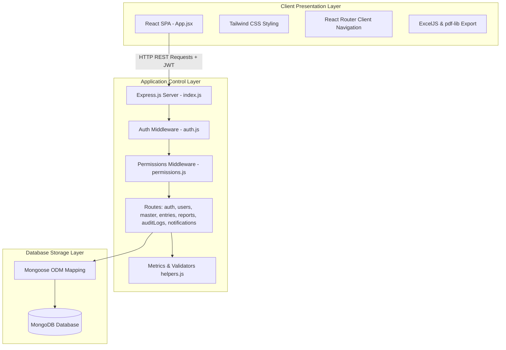
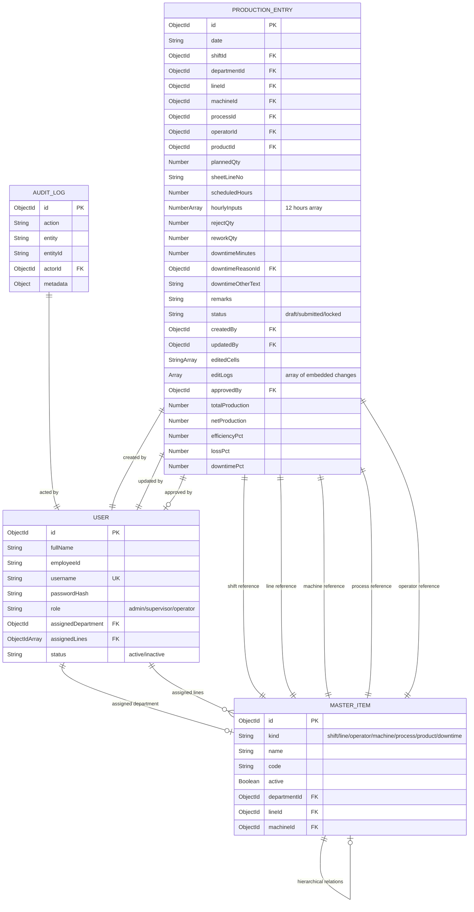
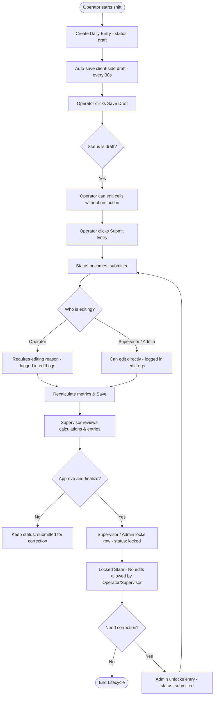
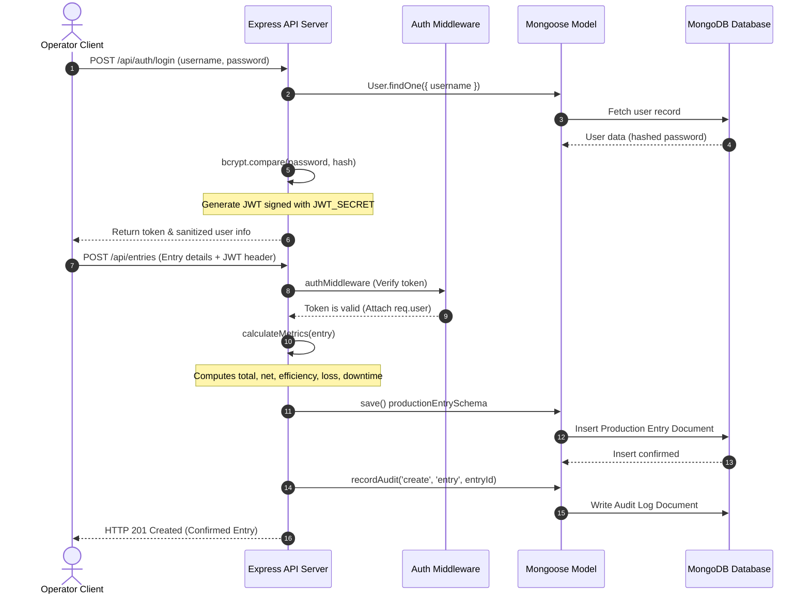

<style>
body {
  font-family: 'Times New Roman', Times, serif;
  font-size: 12pt;
  line-height: 1.5;
  text-align: justify;
}
h1 {
  font-size: 16pt;
  text-align: center;
  page-break-before: always;
}
h2, h3, h4 {
  font-size: 14pt;
}
</style>

# CHAPTER 3: PROPOSED DESIGN & IMPLEMENTATION

## 3.1 Requirements Analysis
To design and build the Smart Production Monitoring System (LineOps), a comprehensive Software Requirement Specification (SRS) was formulated based on manufacturing shop-floor constraints.

### 3.1.1 Functional Requirements
The functional requirements define the core actions that the system must support:
- **User Authentication**: Secure role-based login (Admin, Supervisor, Operator) using credentials, issuing JSON Web Tokens.
- **Master Data Management (MDM)**: Administrators must be able to configure shifts, departments, lines, machines, processes, operators, products, and downtime reasons.
- **Dependent Dropdown Validation**: Selection of a Line must filter Machines; selection of a Machine must filter Processes; and selection of a Department must filter Operators.
- **Spreadsheet-like Daily Entry**: Operators must be able to log planned targets, hourly production (Hour 1 to Hour 12), rejects, reworks, downtime minutes, and downtime reasons in a grid layout.
- **Auto Calculations**: Automatic, instant computation of total production, net production, efficiency, loss, and downtime percentages.
- **Record Locking**: Supervisors and Admins must have the authority to lock finalized rows. Admins can unlock locked rows to permit corrections.
- **Audit Trails**: Every modification to a production record must append a log detailing the modified field, old value, new value, actor ID, timestamp, and edit reason.
- **Report Generation**: Users must be able to filter historic records and export spreadsheets (Excel) and documents (PDF) directly.

### 3.1.2 Non-Functional Requirements
- **Security**: Password hashing using bcryptjs, API rate limiting, Mongoose query filtering, and HTTP token validation.
- **Performance & Latency**: API response times under 200ms for CRUD operations.
- **Usability**: Responsive, mobile-friendly frontend, supporting numerical input modes (`inputMode="numeric"`) for tablet keyboards.
- **Reliability & Consistency**: Auto-save drafts every 30 seconds to prevent loss of data due to network disruptions.

---

## 3.2 System Architecture
LineOps is designed around a three-tier architectural pattern consisting of the Client Presentation Layer, the Application Control Layer, and the Database Storage Layer. Figure 3.1 illustrates the high-level block diagram of the system components and their interactions.


*Figure 3.1: Block Diagram of LineOps Three-Tier Architecture.*

As shown in Figure 3.1, the frontend React application communicates with the Express backend using HTTP requests. Each request carries a JWT in its authorization header. The backend server verifies the token, applies role-based permission checks, processes the request through the designated route handler, performs calculations, and reads or writes data to MongoDB via the Mongoose ODM layer.

---

## 3.3 Folder Structure of the Repository
To maintain clean separation of concerns, the repository is organized into distinct directories for the frontend client and backend server. Figure 3.2 details this layout.

```
LineOps/
│
├── client/                     # Frontend Application Root
│   ├── public/                 # Static Assets
│   ├── src/                    # React Source Files
│   │   ├── api/                # API client connection utilities (client.js)
│   │   ├── components/         # Reusable UI elements (ErrorDialog, GlobalLoader, Toast)
│   │   ├── hooks/              # Custom React hooks (useAuth, useNotification)
│   │   ├── App.jsx             # Main Application Core (tabs, views, state)
│   │   ├── index.css           # Tailwind CSS directives
│   │   └── main.jsx            # Application mount point
│   ├── package.json            # Frontend dependency definitions
│   └── vite.config.js          # Vite build configurations
│
└── server/                     # Backend API Root
    ├── src/                    # Backend Source Files
    │   ├── config/             # Constants, environment variables, rate limits
    │   ├── db/                 # DB connections, master inventories, seeders, importers
    │   ├── middleware/         # Auth checkers, CORS configurations, permissions
    │   ├── models/             # Mongoose schemas (index.js: User, MasterItem, ProductionEntry, AuditLog)
    │   ├── routes/             # REST route files (auth, users, master, entries, reports, auditLogs, notifications)
    │   ├── services/           # Business services (auditService.js)
    │   ├── utils/              # Helper calculations, validators
    │   └── index.js            # Main server entry and DB bootstrapping
    ├── app.js                  # Server script wrapper
    └── package.json            # Backend dependency definitions
```
*Figure 3.2: Folder Structure of the LineOps Repository.*

The layout described in Figure 3.2 ensures that the frontend and backend layers are self-contained. The React client compiles independently of the Node.js server, allowing for containerized deployments (e.g., using Docker).

---

## 3.4 Database Design & Entity Relationship Diagram
The database layer uses MongoDB to store the application's data. Mongoose enforce strict validation rules on the collections. Figure 3.3 presents the Entity Relationship Diagram (ERD).


*Figure 3.3: Entity Relationship Diagram (ERD) of LineOps Collections.*

The database design shown in Figure 3.3 establishes relationships between the primary collections:
1. **User**: Represents physical personnel on the shop floor. Operators are linked to their respective departments and supervisors can be assigned to multiple production lines.
2. **MasterItem**: A unified lookup collection for shifts, lines, machines, processes, operators, products, and downtime reasons. Hierarchical constraints are maintained via self-referencing links: Machines reference their parent Line ID, and Processes reference their parent Machine ID.
3. **ProductionEntry**: The transactional core, recording daily production figures. It references the required master items and tracks edits via an embedded sub-document array (`editLogs`).
4. **AuditLog**: Captures general system operations, mapping actor IDs to actions and affected entities for security auditing.

---

## 3.5 Operational Workflows and Flowcharts
Data consistency on the manufacturing shop floor relies on a structured lifecycle for production entries. Figure 3.4 shows the flowchart for creating, modifying, and locking production records.


*Figure 3.4: Flowchart of Daily Production Entry Lifecycle.*

As detailed in Figure 3.4, a production record starts in a `draft` state, allowing the operator to save work-in-progress figures. Once submitted, the record transitions to `submitted`. Any edits made in this state require an explicit reason, which is logged to the database. Finally, supervisors review the metrics and lock the row to prevent unauthorized edits. Only an administrator can unlock a locked record if corrections are required.

---

## 3.6 Sequence Diagram of Request Lifecycle
To illustrate the message passing and security checks, Figure 3.5 outlines the sequence of events when an operator logs in and submits a production entry.


*Figure 3.5: Sequence Diagram of User Authentication and Production Submission.*

The workflow shown in Figure 3.5 ensures that:
- User passwords are not stored in plain text.
- Session authorization is validated for every transactional API call.
- Calculations are verified on the backend, preventing client-side manipulations of efficiency values.

---

## 3.7 Core Algorithms
The LineOps system relies on three key algorithmic workflows to manage data and computations.

### 3.7.1 Metrics Calculation Algorithm
The metrics helper (`server/src/utils/helpers.js`) calculates production indices from the hourly input array.

$$\text{Total Production} = \sum_{h=1}^{12} \text{hourlyInputs}[h]$$

$$\text{Net Production} = \max(\text{Total Production} - \text{Reject Qty} - \text{Rework Qty}, 0)$$

$$\text{Efficiency \%} = \begin{cases} 
\left( \frac{\text{Net Production}}{\text{Planned Qty}} \right) \times 100 & \text{if Planned Qty} > 0 \\
0 & \text{if Planned Qty} = 0 
\end{cases}$$

$$\text{Loss \%} = \begin{cases} 
\left( \frac{\text{Planned Qty} - \text{Net Production}}{\text{Planned Qty}} \right) \times 100 & \text{if Planned Qty} > 0 \\
0 & \text{if Planned Qty} = 0 
\end{cases}$$

$$\text{Downtime \%} = \left( \frac{\text{Downtime Minutes}}{720} \right) \times 100$$
*(Note: 720 represents the total minutes in a 12-hour monitoring shift).*

### 3.7.2 Excel Import Algorithm
The spreadsheet importer (`server/src/db/importExcelWorkbook.js`) parses master lists and production entries from sheet names.

```
ALGORITHM: ParseExcelWorkbook
INPUT: File path of Excel workbook (.xlsx)
OUTPUT: Seeding validation summary JSON

1. Establish connection to MongoDB
2. Read workbook file using xlsx.readFile()
3. FOR EACH sheetName in workbook:
4.     IF sheetName matches regex "DD.MM.YYYY":
5.         Parse date string (YYYY-MM-DD)
6.         Read cell grid rows, skipping header block (rows 1-3)
7.         FOR EACH row in rows:
8.             IF row has valid Line, Machine, and Shift data:
9.                 Upsert Line Master Item
10.                Upsert Machine Master Item (associated to Line)
11.                Upsert Process Master Item (associated to Machine)
12.                Upsert Operator Master Item
13.                Upsert Shift Master Item
14.                Initialize ProductionEntry Object
15.                Populate target, hourly yields, rejects, and reworks
16.                Calculate metrics (Total, Net, Efficiency, Loss, Downtime)
17.                Save production entry to MongoDB database
18.            END IF
19.        END FOR
20.    END IF
21. END FOR
22. Return confirmation summary
```

### 3.7.3 Audit Log Insertion
Whenever an update request (`PUT /api/entries/:id`) is made, the controller compares the existing document properties against the request body. If changes are detected, it builds an array of changes. For each modified field, it appends a sub-document with the following structure:

```json
{
  "field": "plannedQty",
  "oldValue": 500,
  "newValue": 600,
  "editedBy": "603d2e92c2df6b15e4a8b792",
  "editedAt": "2026-07-12T13:20:00.000Z",
  "reason": "Target adjusted due to component material availability"
}
```

This tracking is saved directly within the production entry document, ensuring that the audit history remains linked to the record it describes.
