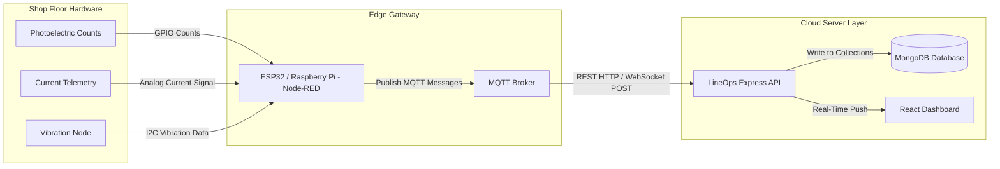

# CHAPTER 5: CONCLUSION & FUTURE SCOPE

## 5.1 Future Scope of the Research
While the LineOps Smart Production Monitoring System successfully replaces manual spreadsheet entry and establishes database validation for manufacturing parameters, it represents the foundational phase of a larger industrial monitoring system. For a dual-degree program in the Internet of Things (IoT), the long-term goal is to transition from manual, operator-entered logs to automated, sensor-driven machine telemetry.

### 5.1.1 IoT Sensor and Hardware Integration
The database schema and API structure of LineOps are designed to accommodate sensor-driven updates. Future hardware integrations can automate data collection:
1. **Production Counting**: Installing infrared photoelectric beam sensors or inductive proximity switches on conveyor lines to count items automatically. These sensor nodes, controlled by ESP32 or Raspberry Pi edge devices, can send count updates to the `/api/entries/:id` endpoint via HTTP POST or MQTT protocols.
2. **Automated Downtime Detection**: Connecting current-transformer (CT) clamp sensors to machine power lines. When current consumption drops below a set threshold, the edge system can log a downtime event, recording start and end times to the database.
3. **Machine Health and Vibration Monitoring**: Integrating accelerometer sensors (e.g., ADXL345) on rotating machinery to stream vibration data to an edge gateway. This data can help establish baseline profiles and warn supervisors of potential machine failures.

*Figure 5.1: Proposed IoT Hardware Data Ingestion Architecture.*

The architecture in Figure 5.1 illustrates the planned path for hardware integration. Utilizing edge gateways, the system can reduce manual entry requirements, minimizing typing delays and human errors.

### 5.1.2 Real-time Messaging and WebSockets
Implementing WebSockets (via Socket.io) would allow the backend to stream live updates to the frontend client without constant page reloading. This capability would enable:
- **Instant Missed Entry Alerts**: Notifying supervisors immediately if an operator fails to log production data during a shift.
- **Downtime Notifications**: Triggering mobile push notifications or automated emails to maintenance engineers when a machine enters an unplanned downtime state.

### 5.1.3 AI-driven Analytics and Predictive Maintenance
Accumulating continuous production data in MongoDB allows for the integration of analytical models:
- **Anomaly Detection**: Using machine learning algorithms to spot unusual yield declines or unexpected increases in reject rates.
- **Predictive Maintenance**: Analyzing vibration, temperature, and historical breakdown patterns to estimate when a machine might require maintenance, allowing teams to schedule service before a failure occurs.

---

## 5.2 Concluding Remarks
The LineOps Smart Production Monitoring System presents a practical, secure, and user-friendly solution to the data entry challenges faced by manufacturing SMEs. By replacing local, error-prone spreadsheets with a centralized, role-based web application, the platform secures shop-floor data and provides visibility into operational performance.

The system meets its primary design objectives:
- **User Roles & Security**: Handled via JWT authentication and bcrypt password hashing.
- **Data Entry**: Streamlined through an interactive, spreadsheet-like editing grid with auto-save draft functionality.
- **Automated Metric Calculations**: Computes KPIs (net production, efficiency, and loss percentages) instantly on the backend.
- **Compliance & Transparency**: Maintained through an automatic edit logging service that records all modifications.

Furthermore, within an IoT curriculum, LineOps serves as the structural foundation for building cyber-physical manufacturing systems. By organizing shop-floor entities (lines, machines, and processes) into a clean, relational model, the application provides the database and API framework needed to ingest and contextualize raw sensor telemetry. This digital foundation is key to enabling smarter, automated, and more efficient manufacturing environments.
