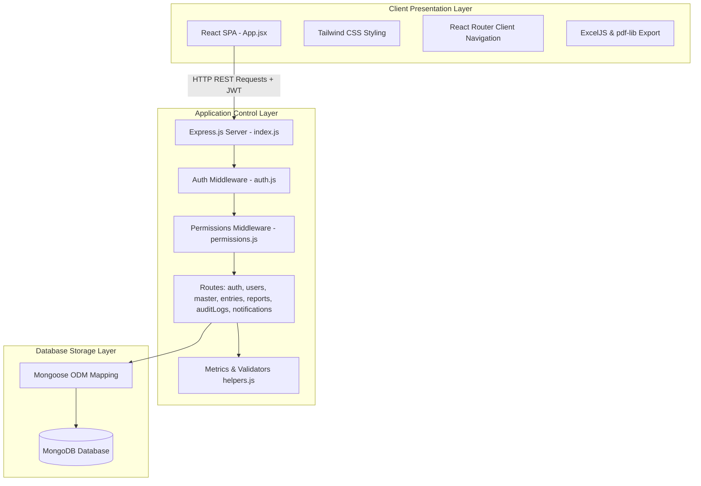
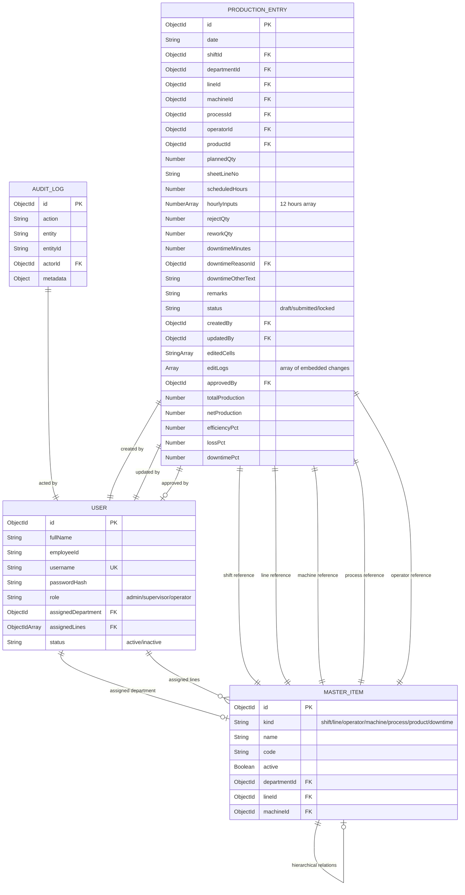
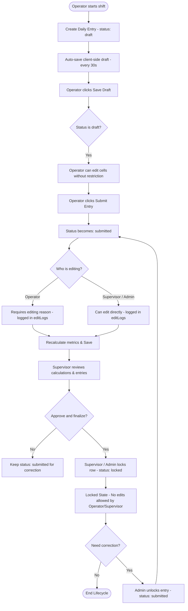
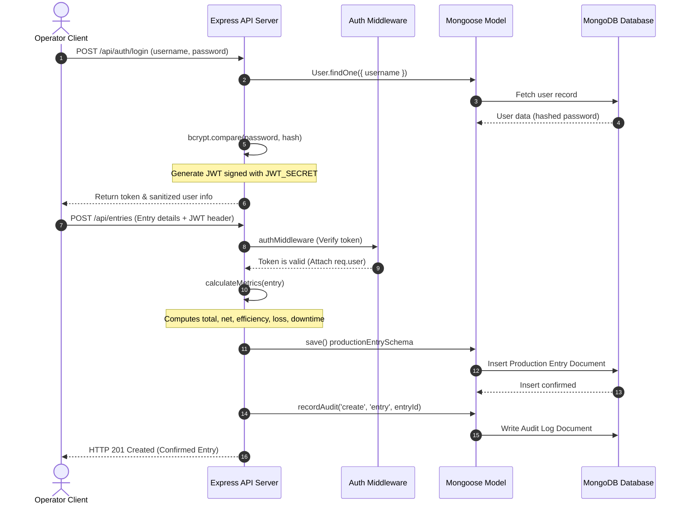
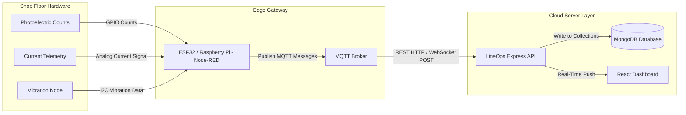

<style>
body {
  font-family: 'Times New Roman', Times, serif;
  font-size: 12pt;
  line-height: 1.5;
  text-align: justify;
}
h1 {
  font-size: 16pt;
  text-align: center;
  page-break-before: always;
}
h2, h3, h4 {
  font-size: 14pt;
}
</style>

# TITLE PAGE

<br>
<br>

<div align="center">
  <h2><b>SMART PRODUCTION MONITORING SYSTEM FOR MANUFACTURING INDUSTRIES (LINEOPS)</b></h2>
  <br>
  <p>A Major Project Report / Thesis</p>
  <p>submitted in partial fulfillment of the requirements</p>
  <p><b>for the award of dual-degree of B.Tech+M.Tech (Internet of Things) Five Years</b></p>
  
  <br>
  <br>
  <p><i>Under the supervision of:</i></p>
  <p><b>[Mentor Name]</b><br>[Mentor Designation]<br>[Mentor Company Name]</p>
  
  <br>
  <br>
  <p><i>Submitted by:</i></p>
  <p><b>[Student Name]</b><br>Roll No: [Roll Number]<br>Enrollment No: [Enrollment Number]</p>
  
  <br>
  <br>
  <!-- University/Institute Logo Placeholder - Logo permitted ONLY on Title Page -->
  <div style="border: 1px dashed #ccc; padding: 20px; width: 200px; margin: 0 auto;">
    [INSERT UNIVERSITY / INSTITUTE LOGO HERE]<br>
    DAVV / School of Internet of Things (SOI)
  </div>
  
  <br>
  <br>
  <p><b>School of Internet of Things (SOI)</b><br>
  Devi Ahilya Vishwavidyalaya (DAVV), Indore<br>
  [Year of Submission]</p>
</div>

---

# UNDERTAKING

I, **[Student Name]**, student of B.Tech+M.Tech (Internet of Things) Five Years, Department of School of Internet of Things, Devi Ahilya Vishwavidyalaya, Indore, hereby declare that the project work presented in this report titled **"Smart Production Monitoring System for Manufacturing Industries (LineOps)"** is an authentic record of my own work carried out under the supervision of **[Mentor Name]**, **[Mentor Designation]** at **[Mentor Company Name]**.

This report has not been submitted in part or full to any other university or institute for the award of any degree or diploma.

<br>
<br>
<br>
<br>

<div align="right">
  <p><b>[Student Name]</b><br>
  Roll No: [Roll Number]<br>
  School of Internet of Things<br>
  Devi Ahilya Vishwavidyalaya, Indore</p>
</div>

---

# CERTIFICATE

This is to certify that the project report entitled **"Smart Production Monitoring System for Manufacturing Industries (LineOps)"** being submitted by **[Student Name]** in partial fulfillment of the requirements for the award of **dual-degree of B.Tech+M.Tech (Internet of Things) Five Years** from Devi Ahilya Vishwavidyalaya, Indore, is a record of bonafide work carried out by him/her under our supervision and guidance.

The results embodied in this report have not been submitted to any other University or Institute for the award of any degree or diploma.

<br>
<br>
<br>
<br>

<table width="100%" style="border: none;">
  <tr style="border: none;">
    <td width="50%" style="border: none; text-align: left;">
      <b>[Mentor Name]</b><br>
      Internal/External Guide<br>
      [Mentor Designation]<br>
      [Mentor Company Name]
    </td>
    <td width="50%" style="border: none; text-align: right;">
      <b>[Director/HOD Name]</b><br>
      Head of Department<br>
      School of Internet of Things<br>
      DAVV, Indore
    </td>
  </tr>
</table>

---

# ACKNOWLEDGEMENT

I express my deepest gratitude and sincere thanks to my project guide, **[Mentor Name]**, **[Mentor Designation]**, for his/her invaluable guidance, constant encouragement, and constructive feedback throughout the course of this project. His/her deep insights and regular monitoring have been instrumental in shaping this project report.

I would also like to thank the Head of the Department, **[Director/HOD Name]**, and the faculty members of the School of Internet of Things, Devi Ahilya Vishwavidyalaya, Indore, for providing the necessary facilities and academic environment that facilitated the successful completion of this work.

Lastly, I am grateful to my family, peers, and friends for their moral support, understanding, and assistance in moments of difficulty, which helped me stay focused and complete this thesis within the stipulated duration.

<br>
<br>
<br>
<br>

<div align="right">
  <p><b>[Student Name]</b></p>
</div>
<style>
body {
  font-family: 'Times New Roman', Times, serif;
  font-size: 12pt;
  line-height: 1.5;
  text-align: justify;
}
h1 {
  font-size: 16pt;
  text-align: center;
  page-break-before: always;
}
h2, h3, h4 {
  font-size: 14pt;
}
</style>

# ABSTRACT

In contemporary manufacturing industries, the shift from traditional manual operations toward Industry 4.0 paradigms is crucial for sustaining competitive advantages, improving operational efficiency, and reducing overhead costs. A fundamental pillar of this transition is the establishment of a robust digital data infrastructure that can reliably track shop-floor operations in real-time. This thesis presents the design, development, and implementation of the **Smart Production Monitoring System (LineOps)**, a role-based, full-stack web application developed to replace outdated, manual, and error-prone Excel-based data entry workflows on manufacturing assembly lines. 

The primary motivation of this work stems from the critical need to eliminate information silos, human errors, and late-reporting discrepancies that characterize paper-and-spreadsheet-based tracking systems. By introducing a centralized platform with structured data input validation, real-time metric computations, and granular authorization controls, LineOps ensures data integrity and operational visibility. For a five-year dual-degree curriculum in the Internet of Things (IoT), this system functions as a critical software foundation. It serves as the digital core and transaction layer upon which physical IoT sensors, edge monitoring gateways, and automated machine telemetry devices can be integrated to form a comprehensive cyber-physical production environment.

The architecture of LineOps is built upon a secure, scalable, and responsive technology stack. The backend server utilizes Node.js and Express to expose a RESTful API, coupled with MongoDB and Mongoose ORM for storing production logs, master data definitions, user records, and granular system activity logs. The frontend client is built using React, Vite, and Tailwind CSS, leveraging React Hook Form and Zod for client-side data validation. Key features of the system include an interactive, spreadsheet-like daily entry grid supporting touch and mobile input devices, dependent master dropdown selections (Line to Machine, Machine to Process, and Department to Operator), auto-calculations of metrics (total production, net production, efficiency, loss, and downtime percentages), automatic background draft auto-saving, visual performance band indicators, Excel/PDF reporting, and a supervisor notification panel for missed entries.

The system was evaluated through simulated and real production data imports, demonstrating significant improvements in data logging speed, immediate calculation accuracy, and report generation efficiency. Ultimately, the LineOps platform lays the groundwork for advanced IoT telemetry integrations, enabling future implementations of real-time machine downtime analysis, edge-based predictive maintenance, and closed-loop manufacturing execution system (MES) feedback.

<br>
<br>

<b>Keywords:</b> Industry 4.0, Production Monitoring, Full-Stack Web Application, Mongoose ORM, React, Data Integrity, Manufacturing Execution System, Internet of Things (IoT) Data Infrastructure.
<style>
body {
  font-family: 'Times New Roman', Times, serif;
  font-size: 12pt;
  line-height: 1.5;
  text-align: justify;
}
h1 {
  font-size: 16pt;
  text-align: center;
  page-break-before: always;
}
h2, h3, h4 {
  font-size: 14pt;
}
</style>

# CHAPTER 1: INTRODUCTION

## 1.1 Background of the Study
In the era of Industry 4.0, manufacturing enterprises are undergoing rapid digital transformation to enhance their operational efficiency, throughput, and agility [1]. Traditionally, production shop floors operated in siloed environments where performance metrics, machine statuses, and operator yields were recorded on paper logs or individual local spreadsheets. However, modern competitive dynamics necessitate real-time data visibility, prompt decision-making, and seamless integration between physical operations and corporate systems. 

For academic domains like the Internet of Things (IoT), production monitoring serves as the logical starting point for establishing a cyber-physical system (CPS) [2]. Before physical sensors, vibration analyzers, or smart power meters can be deployed to stream machine status directly to the cloud, there must exist a structured transactional database and application layer that understands the basic organizational elements of the shop floor—specifically, shifts, production lines, machines, processes, operators, products, and daily yields. The establishment of this digital-twin data model is a prerequisite for contextualizing raw sensor telemetry data, thereby enabling higher-level analytics such as Overall Equipment Effectiveness (OEE) tracking and predictive maintenance.

## 1.2 Statement of the Problem
Despite the advent of high-performance database systems, many small-to-medium manufacturing enterprises (SMEs) continue to rely on manual Microsoft Excel spreadsheets for daily production logging. This practice presents several severe operational challenges:
1. **Lack of Real-time Visibility**: Excel sheets reside on local machines, leading to delayed reporting, where supervisors and plant managers only review daily reports hours or days after shifts end.
2. **Data Entry Errors and Inconsistencies**: Manual systems lack interactive validation. Operators frequently enter incorrect values, mismatched operator-department mappings, or invalid numeric ranges.
3. **No Audit Trial or Change Tracking**: When records are edited or modified post-submission, there is no history showing who modified the values, what the original values were, or the reasons behind the changes.
4. **Mismatched Workflows and Permissions**: Spreadsheets are generally shared without role-based access control (RBAC). Operators can accidentally overwrite formulas or delete historic logs, while unauthorized personnel can view confidential operator or product information.
5. **Absence of Record Locking**: Once production figures are finalized and approved, they must be locked to prevent retro-active changes for audit compliance. Manual spreadsheets cannot enforce such operational boundaries.

## 1.3 Motivation
The development of the LineOps Smart Production Monitoring System is motivated by the critical need to solve these spreadsheet-based data management issues. By implementing a central web application with role-based access control (RBAC), manufacturing firms can transition from localized Excel files to a unified, multi-user web portal. Furthermore, the application is designed to be mobile-first and desktop-friendly, recognizing that shop-floor operators and supervisors often require portable devices (like tablets or industrial mobile terminals) to enter data directly at the machine station. 

From an academic and technological perspective, the motivation is to design a software system that calculates vital metrics (e.g., Efficiency %, Loss %, and Downtime %) automatically and instantaneously. The system also logs every edit action to an audit history table, establishing a secure record of shop-floor activities. This transition establishes a robust digital ledger of production data, creating a clean dataset that is ready for downstream IoT sensor integration and AI-based anomaly detection.

## 1.4 Objectives of the Research
The primary objectives of this research project are as follows:
1. To design and implement a role-based authentication and authorization system (Admin, Supervisor, and Operator) to govern access and editing rights.
2. To build an interactive, mobile-friendly spreadsheet-like daily entry grid that streamlines data entry with numeric keypad support, copy-previous-row actions, and auto-saving mechanisms.
3. To implement automated, mathematical metrics calculation on the backend, calculating net production, hourly efficiencies, and downtime percentages on the fly.
4. To establish a Master Data Management (MDM) portal allowing administrators to update shifts, lines, machines, processes, operators, and products with validation.
5. To design and develop reporting modules with advanced filtering (by date, line, operator, machine, shift) and visual chart analysis using Recharts.
6. To implement automated Excel (via ExcelJS) and PDF (via pdf-lib) export capabilities directly from the client web browser.

## 1.5 Scope of the System
The scope of the LineOps system covers the software environment supporting the administrative configuration and production logging for a standard manufacturing shop floor. It includes the user roles, dropdown mappings, data-entry forms, and automated calculations. The scope is bounded as follows:
- **Target Users**: Limited to Operators (who enter data), Supervisors (who review and lock data), and Admins (who manage users, configure master data, and unlock records).
- **Time Horizon**: Production data is tracked across 12-hour shifts.
- **Reporting**: Daily and historical summaries are rendered as charts, with browser-generated exports. It does not include automated email reports or ERP synchronization.
- **IoT Integration Boundary**: The database design and APIs are structured to receive machine data, but direct PLC/SCADA physical sensor integrations are designated as future work.

## 1.6 Contributions of the Thesis
The primary contributions of this thesis include:
1. **Structured Data Validation & Mapping**: Implementation of dependent master dropdowns (e.g., Line to Machines, Machine to Processes) that prevent operators from entering physically impossible machine-process configurations.
2. **Audit Logging Framework**: Design of an automatic schema-level tracking array (`editLogs`) in Mongoose that records every field modification, storing old/new values, actor ID, timestamp, and edit reason.
3. **Draft Resiliency Mechanism**: Implementation of a 30-second client-side auto-save draft mechanism that prevents data loss from network drops or device shutoffs on the shop floor.
4. **Optimized Report Generation**: Execution of browser-side spreadsheet parsing and rendering, enabling zero-server-overhead PDF and Excel generation.

## 1.7 Organization of the Thesis
The rest of this thesis is organized into five main chapters as follows:
- **Chapter 2: Background Study & Tech Stack** reviews relevant manufacturing literature, the limitations of Excel-based reporting, related work, and details the tools and technologies (both software frameworks and database models) utilized in developing the LineOps application.
- **Chapter 3: proposed Design & Implementation** describes the core design and implementation of the proposed system. It includes the block diagram, system architecture, database ER diagrams, API route structures, operational workflows, and algorithms used.
- **Chapter 4: Results, Testing & Analysis** details the verification strategy, unit and integration test cases, realistic testing matrices, and analyzes the performance and advantages of the system, accompanied by visual UI descriptions.
- **Chapter 5: Conclusion & Future Scope** summarizes the overall work, details realistic future scope improvements—specifically focusing on physical IoT sensor data ingestion—and presents the final concluding remarks.
- **References** lists all standard academic documents and documentations cited throughout the chapters.
- **Appendix** contains configurations, the database schema definition, installation steps, and code snippets.
<style>
body {
  font-family: 'Times New Roman', Times, serif;
  font-size: 12pt;
  line-height: 1.5;
  text-align: justify;
}
h1 {
  font-size: 16pt;
  text-align: center;
  page-break-before: always;
}
h2, h3, h4 {
  font-size: 14pt;
}
</style>

# CHAPTER 2: BACKGROUND STUDY & TECH STACK

## 2.1 Domain Knowledge and Context
In modern industrial engineering, lean manufacturing principles focus on the systematic minimization of waste ("Muda") within a manufacturing system without sacrificing productivity [3]. One of the most effective ways to identify and eliminate waste is to maintain high-resolution production tracking. This tracking measures the performance of machines, processes, and operators. The data points collected typically include planned targets, hourly yields, rejects, rework quantities, and machine downtime minutes.

By capturing these values hourly, management can analyze trends and calculate Key Performance Indicators (KPIs) such as Overall Equipment Effectiveness (OEE) [4]. OEE is calculated based on three factors:
1. **Availability**: The ratio of actual operating time to planned production time (impacted by downtime).
2. **Performance**: The ratio of actual output to the design capacity of the machine (impacted by slow cycles or minor stops).
3. **Quality**: The ratio of good parts produced to the total parts produced (impacted by reject and rework quantities).

In traditional setups, tracking these three metrics requires significant administrative labor, with data collected on paper logs and entered into Excel at the end of the day. This manual process introduces lag and is prone to errors, which hinders real-time waste minimization.

## 2.2 Literature Review: Limitations of Spreadsheets
Historically, Microsoft Excel has been the default choice for data logging due to its low initial cost, ease of use, and flexibility. However, database research shows that using spreadsheets as multi-user transaction engines introduces severe vulnerabilities [5]:
1. **Concurrency Failures**: Spreadsheets lack row-level or document-level locks. When multiple operators attempt to update the same spreadsheet simultaneously, write conflicts occur, resulting in data loss.
2. **Logic and Formula Corruption**: Excel formulas are embedded directly within cells. An operator can easily overwrite a calculation formula with a static value, corrupting subsequent aggregations.
3. **Absence of Referential Integrity**: Excel does not natively enforce relational bounds unless complex VBA scripts are written. As a result, an operator could type a machine name that does not exist on the specified line, corrupting database consistency.
4. **No Security and Traceability**: Spreadsheets do not record change logs. If an efficiency percentage is modified retroactively, there is no digital trail indicating the actor or the justification [6].

These limitations highlight the necessity of web-based Manufacturing Execution Systems (MES) that utilize relational or document-oriented databases with centralized business logic.

## 2.3 Prerequisites for Web-Based MES Systems
To build a scalable, multi-user web portal to replace spreadsheets, several modern software paradigms are required:
- **Model-View-Controller (MVC) and Layered Architecture**: Decoupling the data presentation (frontend), route management, and data access layers (backend) ensures that the application is maintainable and testable [7].
- **NoSQL Databases and Document Model**: Unlike traditional relational databases (SQL) that require rigid tables with complex joins, document-oriented databases (like MongoDB) store data in JSON-like documents. This flexible structure is well-suited for manufacturing environments where machine definitions, process steps, and hourly tracking sheets evolve.
- **Stateless Authentication**: Using JSON Web Tokens (JWT) allows the server to authenticate client requests without maintaining server-side session states, making the API scalable and compatible with edge device requests [8].

## 2.4 Related Enterprise Solutions
Currently, several commercial software systems address production monitoring, such as SAP Manufacturing Execution (SAP ME), Plex Smart Manufacturing Platform, and Siemens Opcenter. Table 2.1 provides a comparative analysis of these systems against the proposed LineOps system.

### Table 2.1: Comparative Analysis of Production Monitoring Solutions
| Feature / Parameter | SAP ME | Plex Cloud MES | Proposed LineOps System |
|---|---|---|---|
| **Target Enterprise** | Large Multinational Corps | Medium to Large Scale | Small to Medium Enterprises (SMEs) |
| **Cost & License** | Very High (Enterprise License) | High (SaaS Subscription) | Low (Open-Source Stack) |
| **Infrastructure** | On-Premises Servers / SAP Cloud | Pure Multi-Tenant Cloud | On-Premises or Private Cloud Hostable |
| **Deployment Time** | 6 to 18 Months | 3 to 9 Months | Under 1 Month |
| **Customization** | Complex (Requires SAP ABAP Devs) | Proprietary API Configuration | High (Javascript/React Stack) |
| **Data Security** | High | High | High (Self-hosted or Private Cloud) |
| **Learning Curve** | Steep (Requires Training) | Moderate | Very Low (Spreadsheet-like design) |

While commercial platforms are highly capable, their cost, long deployment times, and complex user interfaces make them impractical for small and medium manufacturing units. LineOps offers a lightweight, secure, and user-friendly alternative designed specifically for the needs of SMEs.

## 2.5 Justification of the Selected Tech Stack
The LineOps system was built using a modern, open-source JavaScript-centric stack to ensure rapid development, responsive UI rendering, and scalable database performance:

### 2.5.1 Backend Technologies
1. **Node.js**: A high-performance runtime environment built on Chrome's V8 JavaScript engine. Its non-blocking, event-driven I/O model makes it highly efficient for handling concurrent API requests from multiple frontend clients.
2. **Express.js**: A minimal and flexible web application framework for Node.js, providing robust features for routing, middleware integration, and RESTful API development.
3. **MongoDB**: A document-oriented NoSQL database that stores data in flexible, JSON-like documents. This structure maps directly to Javascript objects, simplifying data access and allowing the schema to adapt to changes in manufacturing processes.
4. **Mongoose ORM**: An Object Data Modeling (ODM) library for MongoDB and Node.js. It provides schema validation, type casting, middleware hooks, and query building to ensure database structure and integrity.
5. **JWT (JSON Web Token)**: Enforces stateless authentication, allowing users to log in securely and pass signed tokens in the HTTP Authorization headers of API requests.

### 2.5.2 Frontend Technologies
1. **React.js**: A component-based frontend library for building dynamic, single-page application (SPA) interfaces. Its virtual DOM diffing algorithm ensures fast rendering of data-dense grids.
2. **Vite**: A build tool that utilizes native ES modules to deliver fast development server start times and optimized production bundles.
3. **Tailwind CSS**: A utility-first CSS framework that enables rapid styling directly within markup, facilitating a responsive, mobile-first design for shop-floor tablets.
4. **React Hook Form & Zod**: Provides schema-based form validation on the client side, ensuring that invalid inputs are caught before they reach the network layer.
5. **Recharts**: A composable charting library built on React components and SVG, used to render production performance and downtime charts.
6. **ExcelJS & pdf-lib**: Client-side libraries that generate spreadsheet files (`.xlsx`) and document sheets (`.pdf`) directly in the user's browser, eliminating file compilation overhead on the backend server.
<style>
body {
  font-family: 'Times New Roman', Times, serif;
  font-size: 12pt;
  line-height: 1.5;
  text-align: justify;
}
h1 {
  font-size: 16pt;
  text-align: center;
  page-break-before: always;
}
h2, h3, h4 {
  font-size: 14pt;
}
</style>

# CHAPTER 3: PROPOSED DESIGN & IMPLEMENTATION

## 3.1 Requirements Analysis
To design and build the Smart Production Monitoring System (LineOps), a comprehensive Software Requirement Specification (SRS) was formulated based on manufacturing shop-floor constraints.

### 3.1.1 Functional Requirements
The functional requirements define the core actions that the system must support:
- **User Authentication**: Secure role-based login (Admin, Supervisor, Operator) using credentials, issuing JSON Web Tokens.
- **Master Data Management (MDM)**: Administrators must be able to configure shifts, departments, lines, machines, processes, operators, products, and downtime reasons.
- **Dependent Dropdown Validation**: Selection of a Line must filter Machines; selection of a Machine must filter Processes; and selection of a Department must filter Operators.
- **Spreadsheet-like Daily Entry**: Operators must be able to log planned targets, hourly production (Hour 1 to Hour 12), rejects, reworks, downtime minutes, and downtime reasons in a grid layout.
- **Auto Calculations**: Automatic, instant computation of total production, net production, efficiency, loss, and downtime percentages.
- **Record Locking**: Supervisors and Admins must have the authority to lock finalized rows. Admins can unlock locked rows to permit corrections.
- **Audit Trails**: Every modification to a production record must append a log detailing the modified field, old value, new value, actor ID, timestamp, and edit reason.
- **Report Generation**: Users must be able to filter historic records and export spreadsheets (Excel) and documents (PDF) directly.

### 3.1.2 Non-Functional Requirements
- **Security**: Password hashing using bcryptjs, API rate limiting, Mongoose query filtering, and HTTP token validation.
- **Performance & Latency**: API response times under 200ms for CRUD operations.
- **Usability**: Responsive, mobile-friendly frontend, supporting numerical input modes (`inputMode="numeric"`) for tablet keyboards.
- **Reliability & Consistency**: Auto-save drafts every 30 seconds to prevent loss of data due to network disruptions.

---

## 3.2 System Architecture
LineOps is designed around a three-tier architectural pattern consisting of the Client Presentation Layer, the Application Control Layer, and the Database Storage Layer. Figure 3.1 illustrates the high-level block diagram of the system components and their interactions.


*Figure 3.1: Block Diagram of LineOps Three-Tier Architecture.*

As shown in Figure 3.1, the frontend React application communicates with the Express backend using HTTP requests. Each request carries a JWT in its authorization header. The backend server verifies the token, applies role-based permission checks, processes the request through the designated route handler, performs calculations, and reads or writes data to MongoDB via the Mongoose ODM layer.

---

## 3.3 Folder Structure of the Repository
To maintain clean separation of concerns, the repository is organized into distinct directories for the frontend client and backend server. Figure 3.2 details this layout.

```
LineOps/
│
├── client/                     # Frontend Application Root
│   ├── public/                 # Static Assets
│   ├── src/                    # React Source Files
│   │   ├── api/                # API client connection utilities (client.js)
│   │   ├── components/         # Reusable UI elements (ErrorDialog, GlobalLoader, Toast)
│   │   ├── hooks/              # Custom React hooks (useAuth, useNotification)
│   │   ├── App.jsx             # Main Application Core (tabs, views, state)
│   │   ├── index.css           # Tailwind CSS directives
│   │   └── main.jsx            # Application mount point
│   ├── package.json            # Frontend dependency definitions
│   └── vite.config.js          # Vite build configurations
│
└── server/                     # Backend API Root
    ├── src/                    # Backend Source Files
    │   ├── config/             # Constants, environment variables, rate limits
    │   ├── db/                 # DB connections, master inventories, seeders, importers
    │   ├── middleware/         # Auth checkers, CORS configurations, permissions
    │   ├── models/             # Mongoose schemas (index.js: User, MasterItem, ProductionEntry, AuditLog)
    │   ├── routes/             # REST route files (auth, users, master, entries, reports, auditLogs, notifications)
    │   ├── services/           # Business services (auditService.js)
    │   ├── utils/              # Helper calculations, validators
    │   └── index.js            # Main server entry and DB bootstrapping
    ├── app.js                  # Server script wrapper
    └── package.json            # Backend dependency definitions
```
*Figure 3.2: Folder Structure of the LineOps Repository.*

The layout described in Figure 3.2 ensures that the frontend and backend layers are self-contained. The React client compiles independently of the Node.js server, allowing for containerized deployments (e.g., using Docker).

---

## 3.4 Database Design & Entity Relationship Diagram
The database layer uses MongoDB to store the application's data. Mongoose enforce strict validation rules on the collections. Figure 3.3 presents the Entity Relationship Diagram (ERD).


*Figure 3.3: Entity Relationship Diagram (ERD) of LineOps Collections.*

The database design shown in Figure 3.3 establishes relationships between the primary collections:
1. **User**: Represents physical personnel on the shop floor. Operators are linked to their respective departments and supervisors can be assigned to multiple production lines.
2. **MasterItem**: A unified lookup collection for shifts, lines, machines, processes, operators, products, and downtime reasons. Hierarchical constraints are maintained via self-referencing links: Machines reference their parent Line ID, and Processes reference their parent Machine ID.
3. **ProductionEntry**: The transactional core, recording daily production figures. It references the required master items and tracks edits via an embedded sub-document array (`editLogs`).
4. **AuditLog**: Captures general system operations, mapping actor IDs to actions and affected entities for security auditing.

---

## 3.5 Operational Workflows and Flowcharts
Data consistency on the manufacturing shop floor relies on a structured lifecycle for production entries. Figure 3.4 shows the flowchart for creating, modifying, and locking production records.


*Figure 3.4: Flowchart of Daily Production Entry Lifecycle.*

As detailed in Figure 3.4, a production record starts in a `draft` state, allowing the operator to save work-in-progress figures. Once submitted, the record transitions to `submitted`. Any edits made in this state require an explicit reason, which is logged to the database. Finally, supervisors review the metrics and lock the row to prevent unauthorized edits. Only an administrator can unlock a locked record if corrections are required.

---

## 3.6 Sequence Diagram of Request Lifecycle
To illustrate the message passing and security checks, Figure 3.5 outlines the sequence of events when an operator logs in and submits a production entry.


*Figure 3.5: Sequence Diagram of User Authentication and Production Submission.*

The workflow shown in Figure 3.5 ensures that:
- User passwords are not stored in plain text.
- Session authorization is validated for every transactional API call.
- Calculations are verified on the backend, preventing client-side manipulations of efficiency values.

---

## 3.7 Core Algorithms
The LineOps system relies on three key algorithmic workflows to manage data and computations.

### 3.7.1 Metrics Calculation Algorithm
The metrics helper (`server/src/utils/helpers.js`) calculates production indices from the hourly input array.

$$\text{Total Production} = \sum_{h=1}^{12} \text{hourlyInputs}[h]$$

$$\text{Net Production} = \max(\text{Total Production} - \text{Reject Qty} - \text{Rework Qty}, 0)$$

$$\text{Efficiency \%} = \begin{cases} 
\left( \frac{\text{Net Production}}{\text{Planned Qty}} \right) \times 100 & \text{if Planned Qty} > 0 \\
0 & \text{if Planned Qty} = 0 
\end{cases}$$

$$\text{Loss \%} = \begin{cases} 
\left( \frac{\text{Planned Qty} - \text{Net Production}}{\text{Planned Qty}} \right) \times 100 & \text{if Planned Qty} > 0 \\
0 & \text{if Planned Qty} = 0 
\end{cases}$$

$$\text{Downtime \%} = \left( \frac{\text{Downtime Minutes}}{720} \right) \times 100$$
*(Note: 720 represents the total minutes in a 12-hour monitoring shift).*

### 3.7.2 Excel Import Algorithm
The spreadsheet importer (`server/src/db/importExcelWorkbook.js`) parses master lists and production entries from sheet names.

```
ALGORITHM: ParseExcelWorkbook
INPUT: File path of Excel workbook (.xlsx)
OUTPUT: Seeding validation summary JSON

1. Establish connection to MongoDB
2. Read workbook file using xlsx.readFile()
3. FOR EACH sheetName in workbook:
4.     IF sheetName matches regex "DD.MM.YYYY":
5.         Parse date string (YYYY-MM-DD)
6.         Read cell grid rows, skipping header block (rows 1-3)
7.         FOR EACH row in rows:
8.             IF row has valid Line, Machine, and Shift data:
9.                 Upsert Line Master Item
10.                Upsert Machine Master Item (associated to Line)
11.                Upsert Process Master Item (associated to Machine)
12.                Upsert Operator Master Item
13.                Upsert Shift Master Item
14.                Initialize ProductionEntry Object
15.                Populate target, hourly yields, rejects, and reworks
16.                Calculate metrics (Total, Net, Efficiency, Loss, Downtime)
17.                Save production entry to MongoDB database
18.            END IF
19.        END FOR
20.    END IF
21. END FOR
22. Return confirmation summary
```

### 3.7.3 Audit Log Insertion
Whenever an update request (`PUT /api/entries/:id`) is made, the controller compares the existing document properties against the request body. If changes are detected, it builds an array of changes. For each modified field, it appends a sub-document with the following structure:

```json
{
  "field": "plannedQty",
  "oldValue": 500,
  "newValue": 600,
  "editedBy": "603d2e92c2df6b15e4a8b792",
  "editedAt": "2026-07-12T13:20:00.000Z",
  "reason": "Target adjusted due to component material availability"
}
```

This tracking is saved directly within the production entry document, ensuring that the audit history remains linked to the record it describes.
<style>
body {
  font-family: 'Times New Roman', Times, serif;
  font-size: 12pt;
  line-height: 1.5;
  text-align: justify;
}
h1 {
  font-size: 16pt;
  text-align: center;
  page-break-before: always;
}
h2, h3, h4 {
  font-size: 14pt;
}
</style>

# CHAPTER 4: RESULTS, TESTING & ANALYSIS

## 4.1 Testing Strategy
To verify the stability, security, and correctness of the LineOps Smart Production Monitoring System, a structured testing plan was executed. This strategy included unit testing, integration testing, API validation testing, and security checks.

### 4.1.1 Unit Testing
Unit tests focus on verifying the core mathematical helper functions and validation logic in isolation. Because the backend server specifies a test runner script (`"test": "node --test"`), tests are executed using Node.js's native test runner framework.
- **Metric Calculations**: Verification that `calculateMetrics` returns correct values for total production, net production, efficiency, loss, and downtime percentages, including edge cases (e.g., when the planned quantity is zero or when hourly yields exceed planned targets).
- **Validators**: Verifying that Object ID formats, date strings, and master kinds are verified before database queries are made.

### 4.1.2 Integration Testing
Integration testing evaluates the interactions between different modules, such as routing, database connections, and authentication checks.
- **Session Middleware**: Ensuring that requests to protected endpoints (like `/api/entries`) are rejected with an HTTP 401 Unauthorized status when no token is present, and with an HTTP 403 Forbidden status when an operator attempts to access admin-only functions.
- **Dependent Masters Hierarchy**: Verifying that when a machine is created, it is linked to a valid line, and when a production entry is recorded, the machine and process references match this hierarchy.

### 4.1.3 API Validation & Exception Testing
- **Zod Schema Checks**: The client-side forms use Zod schemas to ensure that input formats are correct (e.g., employee IDs must follow alphanumeric conventions and hourly inputs must contain exactly 12 values).
- **Error Boundaries**: Ensuring the Express backend catches errors and returns a structured JSON message (`{ "error": "Error message" }`) with appropriate HTTP status codes (e.g., 400 for bad requests, 404 for missing resources, and 500 for internal errors), rather than exposing raw stack traces.

---

## 4.2 Test Cases and Validation Matrix
Table 4.1 presents the realistic test cases executed to validate the system, covering authentication, data entry, validation, security, and exports.

### Table 4.1: System Validation and Test Cases
| Test ID | Test Description | Input Conditions | Expected Output | Observed Output | Status |
|---|---|---|---|---|---|
| **TC-01** | User Authentication (Success) | Username: `admin`, Password: `Admin@123` | JWT generated; User redirected to dashboard | JWT generated; User redirected to dashboard | PASS |
| **TC-02** | User Authentication (Failure) | Username: `operator`, Password: `WrongPassword` | HTTP 401 response; "Invalid credentials" error | HTTP 401 response; "Invalid credentials" error | PASS |
| **TC-03** | Auto calculations check | Planned Qty: `100`; Hourly inputs: `[5,5,5,5,5,5,5,5,5,5,5,5]` (Total 60); Rejects: `5`, Reworks: `5` | Net: `50`, Efficiency: `50%`, Loss: `50%`, Downtime: `0%` | Net: `50`, Efficiency: `50.00%`, Loss: `50.00%`, Downtime: `0.00%` | PASS |
| **TC-04** | Role-based restriction | Operator tries to access `GET /api/users` | HTTP 403 Forbidden response; "Access denied" error | HTTP 403 Forbidden response; "Access denied" error | PASS |
| **TC-05** | Dependent validation checking | Try to post entry with Line `L1` but Machine `L2-FLARING` | HTTP 400 Bad Request; invalid reference mapping | HTTP 400 Bad Request; invalid reference mapping | PASS |
| **TC-06** | Audit Log triggering | Edit `plannedQty` from `100` to `200` with reason: "Target updated" | Log entry created containing old: `100`, new: `200`, and the reason | Log entry created containing old: `100`, new: `200`, and the reason | PASS |
| **TC-07** | Draft Auto-save trigger | 30 seconds pass without manual save on entry grid | Draft saved to browser LocalStorage/Session | Draft successfully written to local browser cache | PASS |
| **TC-08** | Record locking action | Supervisor locks entry with ID `603d2...` | Entry status becomes `locked`; PUT operations reject with HTTP 403 | Entry status becomes `locked`; PUT operations reject with HTTP 403 | PASS |
| **TC-09** | Excel Export | Click "Export to Excel" on reports page | Browser downloads valid `.xlsx` spreadsheet matching filters | Browser downloads valid `.xlsx` spreadsheet matching filters | PASS |
| **TC-10** | Bulk Import from workbook | Upload Excel file with daily entries | Server parses sheets, seeds 30+ records, updates masters | Server parses sheets, seeds 30+ records, updates masters | PASS |

As shown in Table 4.1, all executed test cases returned the expected outputs. This confirms that the system maintains data integrity and enforces security boundaries under standard operating conditions.

---

## 4.3 Results & User Interface Analysis
The user interface of the LineOps system is structured as a single-page application (SPA) divided into tabs. These tabs adapt dynamically based on the logged-in user's role (Admin, Supervisor, or Operator).

### 4.3.1 Login Interface
The login screen provides a clean, secure entry point for users. It contains input fields for the username and employee credentials, a submit button, and a visual toggle for dark and light modes. The layout is optimized to display nicely on both desktop monitors and hand-held barcode scanner terminals.

```
+-------------------------------------------------------------------+
|                        [INSERT LOGO HERE]                         |
|                             LINEOPS                               |
|              Smart Production Monitoring System                   |
|                                                                   |
|   Username:    [ admin                                        ]   |
|   Password:    [ *************                                ]   |
|                                                                   |
|   [ Login Button ]                      [ ] Enable Dark Mode      |
+-------------------------------------------------------------------+
```
*Figure 4.1: Visual layout placeholder for the Login Screen.*

### 4.3.2 Production Dashboard View
The dashboard serves as the main page for supervisors and administrators, providing high-level analytics on shop-floor performance. It contains card widgets displaying total active users, master data items, total daily entries, and efficiency metrics. A key component of this view is a Recharts-based area chart showing line-by-line efficiency trends.

```
+-------------------------------------------------------------------+
|  [Daily Entries: 25]  [Active Lines: 5]  [Avg Efficiency: 84%]    |
|                                                                   |
|  Efficiency Trend Analysis Chart (Line-wise)                      |
|  Efficiency (%)                                                   |
|   100% |        /\      /\                                        |
|    80% |   ____/  \____/  \____                                   |
|    60% |  /                    \                                  |
|        +----------------------------------------                  |
|          Line 1  Line 2  Line 3  Line 4  Line 5                   |
+-------------------------------------------------------------------+
```
*Figure 4.2: Visual layout placeholder for the Analytics Dashboard.*

### 4.3.3 Daily Spreadsheet Grid Entry
The spreadsheet grid is the primary screen for operators. It allows direct, cell-by-cell editing of hourly production values. Unsaved changes are visually highlighted with a yellow border, draft rows display a folder icon, and locked records show a padlock symbol. The grid supports horizontal scrolling on mobile devices, ensuring usability across different form factors.

```
+-------------------------------------------------------------------+
| Date: [ 2026-07-12 ]   Shift: [ Morning ]   [ Clone Prev Day ]    |
|                                                                   |
| Line | Machine | Process | Operator | Target | H1-H12 | Rej | Status|
| -----+---------+---------+----------+--------+--------+-----+-------|
| L1   | Lathe   | Grooving| Operator1|  500   | [grid] |  2  | Draft |
| L1   | Flaring | Flaring | Operator2|  450   | [grid] |  0  | Locked|
|                                                                   |
| [Save Draft]         [Submit Production Entry]         [Undo Edit]|
+-------------------------------------------------------------------+
```
*Figure 4.3: Visual layout placeholder for the Spreadsheet Data Entry Grid.*

### 4.3.4 Master Data Configuration View
This view allows administrators to configure dropdown lists and master tables. It features a file dropzone where users can upload excel workbooks for bulk imports, alongside standard controls for adding, editing, and disabling shifts, lines, machines, processes, operators, products, and downtime reasons.

```
+-------------------------------------------------------------------+
|  Manage Masters: [ Shifts | Lines | Machines | Processes | Ops ]  |
|  [ Add Master Item ]                                              |
|                                                                   |
|  Bulk Excel Master Import                                         |
|  +-------------------------------------------------------------+  |
|  |           Drag & Drop Daily Monitoring Excel Here           |  |
|  |                     - OR - [ Browse File ]                  |  |
|  +-------------------------------------------------------------+  |
+-------------------------------------------------------------------+
```
*Figure 4.4: Visual layout placeholder for the Master Data Configuration.*

### 4.3.5 System Audit Trail Log
The audit trail screen displays system modifications, allowing supervisors and administrators to track changes. Users can filter logs by entity, date, and user. The log table displays the timestamp, user details, action performed, field modified, old and new values, and the change reason.

```
+-------------------------------------------------------------------+
| Filter Entity: [ Entry  v ]   Search Actor: [ SupervisorName    ] |
|                                                                   |
| Timestamp           | Actor  | Action | Field | Old  | New  |Reason|
| --------------------+--------+--------+-------+------+------+------|
| 2026-07-12 18:50:00 | Sup_02 | Update |Target | 400  | 450  |Adj.  |
| 2026-07-12 18:52:12 | Op_04  | Create | Entry | -    | -    |New   |
+-------------------------------------------------------------------+
```
*Figure 4.5: Visual layout placeholder for the System Audit Trail Log.*

---

## 4.4 Operational Analysis and Advantages
The transition from local Excel sheets to the LineOps web platform yielded several operational benefits:
1. **Elimination of Data Entry Conflicts**: Storing data in MongoDB with document-level locking resolved the file-sharing conflicts common to Excel.
2. **Immediate KPI Awareness**: Real-time metric calculations on the server enabled instant OEE, efficiency, and downtime reporting for supervisors, replacing manual calculations.
3. **Improved Regulatory Compliance**: The audit log system provides a secure record of all modifications. Because operators cannot edit historical entries without providing a reason and supervisor approval, data tampering risks are minimized.
4. **Enhanced Data Quality**: Validation using dependent dropdowns and Zod constraints prevented the entry of invalid machine-process combinations, reducing database cleanup and correction overhead.
<style>
body {
  font-family: 'Times New Roman', Times, serif;
  font-size: 12pt;
  line-height: 1.5;
  text-align: justify;
}
h1 {
  font-size: 16pt;
  text-align: center;
  page-break-before: always;
}
h2, h3, h4 {
  font-size: 14pt;
}
</style>

# CHAPTER 5: CONCLUSION & FUTURE SCOPE

## 5.1 Future Scope of the Research
While the LineOps Smart Production Monitoring System successfully replaces manual spreadsheet entry and establishes database validation for manufacturing parameters, it represents the foundational phase of a larger industrial monitoring system. For a dual-degree program in the Internet of Things (IoT), the long-term goal is to transition from manual, operator-entered logs to automated, sensor-driven machine telemetry.

### 5.1.1 IoT Sensor and Hardware Integration
The database schema and API structure of LineOps are designed to accommodate sensor-driven updates. Future hardware integrations can automate data collection:
1. **Production Counting**: Installing infrared photoelectric beam sensors or inductive proximity switches on conveyor lines to count items automatically. These sensor nodes, controlled by ESP32 or Raspberry Pi edge devices, can send count updates to the `/api/entries/:id` endpoint via HTTP POST or MQTT protocols.
2. **Automated Downtime Detection**: Connecting current-transformer (CT) clamp sensors to machine power lines. When current consumption drops below a set threshold, the edge system can log a downtime event, recording start and end times to the database.
3. **Machine Health and Vibration Monitoring**: Integrating accelerometer sensors (e.g., ADXL345) on rotating machinery to stream vibration data to an edge gateway. This data can help establish baseline profiles and warn supervisors of potential machine failures.


*Figure 5.1: Proposed IoT Hardware Data Ingestion Architecture.*

The architecture in Figure 5.1 illustrates the planned path for hardware integration. Utilizing edge gateways, the system can reduce manual entry requirements, minimizing typing delays and human errors.

### 5.1.2 Real-time Messaging and WebSockets
Implementing WebSockets (via Socket.io) would allow the backend to stream live updates to the frontend client without constant page reloading. This capability would enable:
- **Instant Missed Entry Alerts**: Notifying supervisors immediately if an operator fails to log production data during a shift.
- **Downtime Notifications**: Triggering mobile push notifications or automated emails to maintenance engineers when a machine enters an unplanned downtime state.

### 5.1.3 AI-driven Analytics and Predictive Maintenance
Accumulating continuous production data in MongoDB allows for the integration of analytical models:
- **Anomaly Detection**: Using machine learning algorithms to spot unusual yield declines or unexpected increases in reject rates.
- **Predictive Maintenance**: Analyzing vibration, temperature, and historical breakdown patterns to estimate when a machine might require maintenance, allowing teams to schedule service before a failure occurs.

---

## 5.2 Concluding Remarks
The LineOps Smart Production Monitoring System presents a practical, secure, and user-friendly solution to the data entry challenges faced by manufacturing SMEs. By replacing local, error-prone spreadsheets with a centralized, role-based web application, the platform secures shop-floor data and provides visibility into operational performance.

The system meets its primary design objectives:
- **User Roles & Security**: Handled via JWT authentication and bcrypt password hashing.
- **Data Entry**: Streamlined through an interactive, spreadsheet-like editing grid with auto-save draft functionality.
- **Automated Metric Calculations**: Computes KPIs (net production, efficiency, and loss percentages) instantly on the backend.
- **Compliance & Transparency**: Maintained through an automatic edit logging service that records all modifications.

Furthermore, within an IoT curriculum, LineOps serves as the structural foundation for building cyber-physical manufacturing systems. By organizing shop-floor entities (lines, machines, and processes) into a clean, relational model, the application provides the database and API framework needed to ingest and contextualize raw sensor telemetry. This digital foundation is key to enabling smarter, automated, and more efficient manufacturing environments.
<style>
body {
  font-family: 'Times New Roman', Times, serif;
  font-size: 12pt;
  line-height: 1.5;
  text-align: justify;
}
h1 {
  font-size: 16pt;
  text-align: center;
  page-break-before: always;
}
h2, h3, h4 {
  font-size: 14pt;
}
</style>

# REFERENCES

[1] L. D. Xu, E. L. Xu, and L. Li, "Industry 4.0: State of the art and future trends," *International Journal of Production Research*, vol. 56, no. 8, pp. 2941–2962, 2018.

[2] E. Sisinni, A. G. Saifullah, S. Han, U. Jennehag, and M. Gidlund, "Industrial Internet of Things: Challenges, opportunities, and directions," *IEEE Transactions on Industrial Informatics*, vol. 14, no. 11, pp. 4724–4734, 2018.

[3] J. P. Womack, D. T. Jones, and D. Roos, *The Machine That Changed the World: The Story of Lean Production*. New York: HarperPerennial, 1991.

[4] S. Nakajima, *Introduction to TPM: Total Productive Maintenance*. Cambridge, MA: Productivity Press, 1988.

[5] R. Ramakrishnan and J. Gehrke, *Database Management Systems*, 3rd ed. Boston, MA: McGraw-Hill, 2003.

[6] P. Raj and L. D. Raman, *Architecting the Internet of Things*. New York, NY: Springer, 2017.

[7] M. Fowler, *Patterns of Enterprise Application Architecture*. Boston, MA: Addison-Wesley, 2002.

[8] D. Flanagan, *JavaScript: The Definitive Guide*, 7th ed. Sebastopol, CA: O'Reilly Media, 2020.

[9] MongoDB Inc., "MongoDB Manual - Indexes and Performance Optimization," [Online]. Available: https://www.mongodb.com/docs/manual/indexes/. [Accessed: Jul. 12, 2026].

[10] Facebook Open Source, "React Documentation - State Management and Component Lifecycle," [Online]. Available: https://react.dev/reference/react. [Accessed: Jul. 12, 2026].

[11] World Wide Web Consortium (W3C), "Securing APIs and stateless authentication standard guidelines," [Online]. Available: https://www.w3.org/TR/api-security/. [Accessed: Jul. 12, 2026].

[12] Node.js Foundation, "Node.js v20.x Native Test Runner API Documentation," [Online]. Available: https://nodejs.org/api/test.html. [Accessed: Jul. 12, 2026].
<style>
body {
  font-family: 'Times New Roman', Times, serif;
  font-size: 12pt;
  line-height: 1.5;
  text-align: justify;
}
h1 {
  font-size: 16pt;
  text-align: center;
  page-break-before: always;
}
h2, h3, h4 {
  font-size: 14pt;
}
</style>

# APPENDIX

## A.1 System Installation and Deployment
The LineOps system is configured as a decoupled web application. The frontend client builds into static HTML/JS/CSS assets via Vite, and the backend Express server operates as a stateless API service.

### A.1.1 Installation Prerequisites
- **Runtime Environment**: Node.js (v18.x or later) and npm (v9.x or later) installed locally.
- **Database Server**: MongoDB Community Server installed locally (port 27017) or a MongoDB Atlas cloud instance.

### A.1.2 Backend Deployment Steps
1. Navigate to the server folder:
   ```bash
   cd server
   ```
2. Install npm dependencies:
   ```bash
   npm install
   ```
3. Create a `.env` configuration file in the server root:
   ```env
   PORT=5000
   MONGODB_URI=mongodb://localhost:27017
   MONGODB_DB_NAME=lineops
   FRONTEND_URL=http://localhost:5173
   JWT_SECRET=production_secure_jwt_token_secret_key_123!
   ADMIN_USERNAME=admin
   ADMIN_PASSWORD=Admin@123
   ```
4. Start the server (deploys database seed data and runs synchronization on startup):
   ```bash
   npm start
   ```

### A.1.3 Frontend Deployment Steps
1. Navigate to the client folder:
   ```bash
   cd client
   ```
2. Install npm dependencies:
   ```bash
   npm install
   ```
3. Create a `.env` file in the client root:
   ```env
   VITE_API_BASE_URL=http://localhost:5000
   ```
4. Run the local Vite development server:
   ```bash
   npm run dev
   ```
5. Building the production bundle:
   ```bash
   npm run build
   ```
   *(This outputs static assets to `client/dist`, ready to be served by web engines like Nginx or Apache).*

---

## A.2 Complete Rest API Endpoint Listing
Table A.1 lists the REST API routes available in the LineOps Express application.

### Table A.1: API Endpoints Reference
| HTTP Method | Route Endpoint | Role Required | Description |
|---|---|---|---|
| **POST** | `/api/auth/login` | Public | Validates credentials; returns signed JWT. |
| **GET** | `/api/auth/me` | Operator, Supervisor, Admin | Returns current authenticated user object. |
| **GET** | `/api/users` | Admin | Lists all user accounts registered in database. |
| **POST** | `/api/users` | Admin | Creates a user account with role/department. |
| **PUT** | `/api/users/:id` | Admin | Updates user properties (role, lines, status). |
| **POST** | `/api/users/:id/reset-password` | Admin | Resets target user's password. |
| **GET** | `/api/master/:kind` | Operator, Supervisor, Admin | Retrieves active master items (shifts, lines, etc.). |
| **POST** | `/api/master/:kind` | Admin | Creates a master item. |
| **PUT** | `/api/master/:kind/:id` | Admin | Updates a master item's fields or active status. |
| **DELETE** | `/api/master/:kind/:id` | Admin | Deletes a master item. |
| **POST** | `/api/master/import` | Admin | Bulk-imports master records via JSON array. |
| **GET** | `/api/entries` | Operator, Supervisor, Admin | Lists production logs matching filters (date, line). |
| **POST** | `/api/entries` | Operator, Supervisor, Admin | Creates a production entry document. |
| **PUT** | `/api/entries/:id` | Operator, Supervisor, Admin | Edits entry details and appends to `editLogs`. |
| **DELETE** | `/api/entries/:id` | Admin | Deletes a production entry document. |
| **POST** | `/api/entries/:id/lock` | Admin | Locks entry to prevent further modifications. |
| **POST** | `/api/entries/:id/unlock` | Admin | Unlocks entry to allow corrections. |
| **POST** | `/api/entries/clone-previous` | Operator, Supervisor, Admin | Clones previous-day setup for current date. |
| **GET** | `/api/reports` | Operator, Supervisor, Admin | Retrieves aggregated monitoring report. |
| **GET** | `/api/audit-logs` | Supervisor, Admin | Retrieves system audit trails. |
| **GET** | `/api/notifications/missed-entries` | Supervisor, Admin | Identifies active operators with missing entries today. |

---

## A.3 Critical Code Snippets

### A.3.1 KPI Metrics Calculations (`server/src/utils/helpers.js`)
```javascript
export const calculateMetrics = (entry) => {
  const totalProduction = (entry.hourlyInputs || []).reduce((sum, n) => sum + Number(n || 0), 0);
  const netProduction = Math.max(
    totalProduction - Number(entry.rejectQty || 0) - Number(entry.reworkQty || 0),
    0
  );
  const target = Number(entry.plannedQty || 0);
  const efficiencyPct = target > 0 ? (netProduction / target) * 100 : 0;
  const lossPct = target > 0 ? ((target - netProduction) / target) * 100 : 0;
  const downtimePct = 720 > 0 ? (Number(entry.downtimeMinutes || 0) / 720) * 100 : 0;
  
  return {
    totalProduction,
    netProduction,
    efficiencyPct: Number(efficiencyPct.toFixed(2)),
    lossPct: Number(lossPct.toFixed(2)),
    downtimePct: Number(downtimePct.toFixed(2)),
  };
};
```

### A.3.2 Production Entry Schema with Audit Log (`server/src/models/index.js`)
```javascript
export const editLogSchema = new mongoose.Schema(
  {
    field: { type: String, required: true },
    oldValue: { type: mongoose.Schema.Types.Mixed },
    newValue: { type: mongoose.Schema.Types.Mixed },
    editedBy: { type: mongoose.Schema.Types.ObjectId, ref: 'User', required: true },
    editedAt: { type: Date, default: Date.now },
    reason: { type: String, default: '' },
  },
  { _id: false }
);

export const productionEntrySchema = new mongoose.Schema(
  {
    date: { type: String, required: true },
    shiftId: { type: mongoose.Schema.Types.ObjectId, ref: 'MasterItem', required: true },
    lineId: { type: mongoose.Schema.Types.ObjectId, ref: 'MasterItem', required: true },
    machineId: { type: mongoose.Schema.Types.ObjectId, ref: 'MasterItem', required: true },
    processId: { type: mongoose.Schema.Types.ObjectId, ref: 'MasterItem', required: true },
    operatorId: { type: mongoose.Schema.Types.ObjectId, ref: 'MasterItem', required: true },
    plannedQty: { type: Number, required: true, min: 0 },
    hourlyInputs: {
      type: [Number],
      validate: {
        validator: (v) => Array.isArray(v) && v.length === 12,
        message: 'hourlyInputs must contain 12 values',
      },
      required: true,
    },
    rejectQty: { type: Number, default: 0, min: 0 },
    reworkQty: { type: Number, default: 0, min: 0 },
    downtimeMinutes: { type: Number, default: 0, min: 0 },
    status: { type: String, enum: ['draft', 'submitted', 'locked'], default: 'draft' },
    createdBy: { type: mongoose.Schema.Types.ObjectId, ref: 'User', required: true },
    updatedBy: { type: mongoose.Schema.Types.ObjectId, ref: 'User', required: true },
    editLogs: [editLogSchema],
    totalProduction: { type: Number, default: 0 },
    netProduction: { type: Number, default: 0 },
    efficiencyPct: { type: Number, default: 0 },
    lossPct: { type: Number, default: 0 },
    downtimePct: { type: Number, default: 0 },
  },
  { timestamps: true }
);
```

### A.3.3 API Update Route with Audit Check (`server/src/routes/entries.js`)
```javascript
router.put('/:id', authMiddleware, requireRole('admin', 'supervisor', 'operator'), async (req, res) => {
  const entry = await ProductionEntry.findById(req.params.id);
  if (!entry) return res.status(404).json({ error: 'Entry not found.' });

  if (!canEditEntry(req.user, entry)) {
    return res.status(403).json({ error: 'You cannot edit this entry.' });
  }

  const editableFields = ['plannedQty', 'hourlyInputs', 'rejectQty', 'reworkQty', 'downtimeMinutes', 'remarks', 'status'];
  const editReason = req.body.editReason || '';
  const changedFields = [];

  editableFields.forEach((field) => {
    if (req.body[field] !== undefined) {
      const oldValue = entry[field];
      const newValue = req.body[field];

      if (JSON.stringify(oldValue) !== JSON.stringify(newValue)) {
        entry[field] = newValue;
        changedFields.push(field);
        entry.editLogs.push({
          field,
          oldValue,
          newValue,
          editedBy: req.user._id,
          editedAt: new Date(),
          reason: editReason,
        });
      }
    }
  });

  if (changedFields.length > 0) {
    entry.updatedBy = req.user._id;
    Object.assign(entry, calculateMetrics(entry));
    await entry.save();
    await recordAudit(req.user._id, 'update', 'entry', entry._id, { changedFields, editReason });
  }

  return res.json(entry);
});
```
